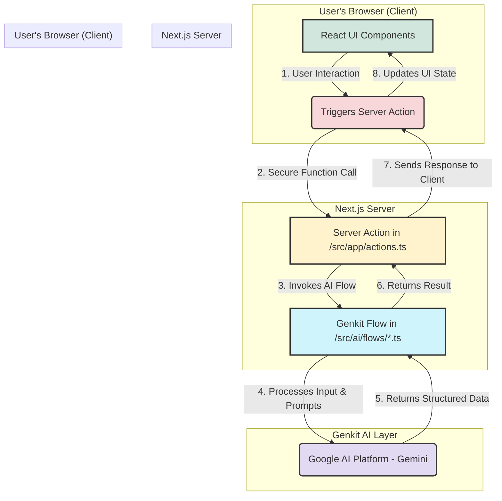

# ManoMitra System Architecture Blueprint

This document outlines the technical architecture of the ManoMitra application, detailing the flow of data from the user interface to the AI-powered backend services.

## Core Principles

-   **Server-Centric Logic:** The application leverages Next.js Server Components and Server Actions to keep as much logic as possible on the server, resulting in a lighter client-side footprint and improved performance.
-   **Component-Based UI:** The user interface is built with React and ShadCN UI components, promoting reusability and a consistent design system.
-   **Decoupled AI Flows:** All generative AI logic is encapsulated within Genkit flows. This separation of concerns makes the AI functionality modular, testable, and easy to maintain.

## Technology Stack

-   **Frontend Framework:** [Next.js](https://nextjs.org/) (with App Router)
-   **UI Library:** [React](https://react.dev/)
-   **UI Components:** [ShadCN UI](https://ui.shadcn.com/)
-   **Styling:** [Tailwind CSS](https://tailwindcss.com/)
-   **AI Toolkit:** [Genkit (by Google)](https://firebase.google.com/docs/genkit)
-   **Client-Server Communication:** [Next.js Server Actions](https://nextjs.org/docs/app/building-your-application/data-fetching/server-actions-and-mutations)

## High-Level Architecture Diagram

The system follows a clear, unidirectional data flow, ensuring predictability and maintainability.

## Detailed Data Flow

1.  **User Interaction:** A user performs an action in the browser, such as sending a message in the AI chat. This interaction is handled by a React component (e.g., `src/components/chat-interface.tsx`).

2.  **Server Action Trigger:** The React component calls a Server Action defined in `src/app/actions.ts`. This call is a secure, server-only function invocation that travels from the client to the server environment.

3.  **AI Flow Invocation:** The Server Action acts as a bridge to the AI logic. It imports and calls the relevant Genkit flow (e.g., `generateCulturallyRelevantResponse` from `src/ai/flows/generate-culturally-relevant-response.ts`), passing along the user's input.

4.  **AI Processing:** The Genkit flow, which is defined with `ai.defineFlow`, processes the input. It formats a prompt using the provided data and sends it to the configured model on the Google AI Platform (e.g., Gemini).

5.  **Structured Data Response:** The AI model processes the prompt and returns a structured JSON object, as defined by the Zod schema in the flow's output configuration.

6.  **Return to Server Action:** The Genkit flow returns this structured JSON object back to the Server Action.

7.  **Response to Client:** The Server Action sends the result back to the original calling component on the client side.

8.  **UI Update:** The React component receives the data, updates its state (e.g., using `useState`), and re-renders to display the AI's response to the user.
